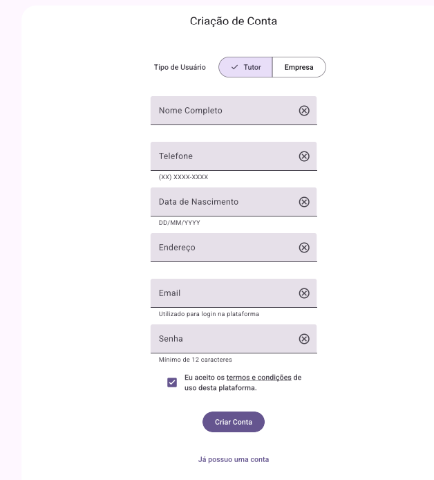
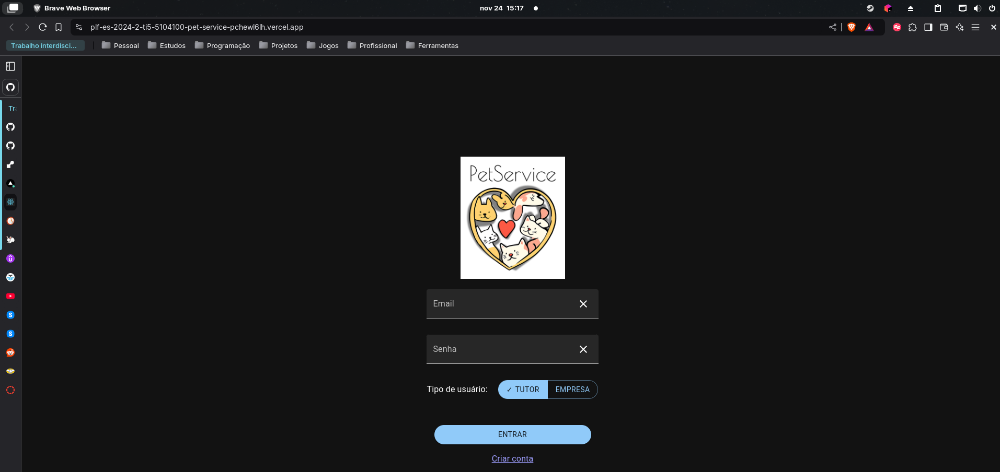

**Arthur Felipe Lopes Ferreira, 1395531@sga.pucminas.br**

**Filipe Iannarelli Caldeira, ficaldeira@sga.pucminas.br**

**Guilherme Lage da Costa, 968722@sga.pucminas.br**

**Ítalo Lélis de Carvalho, italo.carvalho@sga.pucminas.br**

**João Paulo de Sales Pimenta, joao.pimenta.1433569@sga.pucminas.br**

**Lucas Nogueira Mazzieiro de Carvalho, lnmcarvalho@sga.pucminas.br**

---

Professores:

**Cleiton Silva Tavares**

**Hugo Bastos de Paula**

**Ramon Lacerda Marques**

---

_Curso de Engenharia de Software, Unidade Praça da Liberdade_

_Instituto de Informática e Ciências Exatas – Pontifícia Universidade de Minas Gerais (PUC MINAS), Belo Horizonte – MG –
Brasil_

---

## Resumo

O projeto consiste no desenvolvimento de um marketplace digital voltado para o setor de serviços para pets, que vem
apresentando crescimento significativo nos últimos anos. A plataforma será disponibilizada em versões web e aplicativo
nativo, tendo como principal objetivo conectar tutores de animais de estimação com estabelecimentos que
oferecem serviços especializados como Pet Sitter, Banho e Tosa, e Hotel para pets.

A solução proposta busca resolver um problema crescente no mercado: a falta de uma plataforma centralizada que conecte
de forma eficiente e segura os tutores de pets aos prestadores de serviços. Com o aumento do trabalho em formatos
híbridos e remotos, muitos tutores enfrentam desafios em garantir cuidados adequados para seus animais durante o horário
comercial.

O sistema será desenvolvido utilizando Java com Spring Boot no backend, React para a versão web do frontend, e Flutter
para o aplicativo mobile nativo. A arquitetura inclui funcionalidades essenciais como gerenciamento de usuários, pets e
serviços, sistema de agendamento, comunicação entre usuários via mensagens, e um sistema de avaliação bidirecional que
permite tanto tutores quanto prestadores de serviços compartilharem suas experiências.
A plataforma busca não apenas facilitar a contratação de serviços para pets, mas também criar um ambiente seguro e
confiável para todas as partes envolvidas.

---

## Histórico de Revisões

| **Data**       | **Autor**                  | **Descrição**                              | **Versão** |
|----------------|----------------------------|--------------------------------------------|------------|
| **25/08/2024** | Guilherme Lage da Costa    | Iniciado minuta do documento               | 1.0        |
| **01/09/2024** | Guilherme Lage da Costa    | Revisado seções 1 e 2                      | 1.1        |
| **08/09/2024** | Guilherme Lage da Costa    | Revisado seções 1, 2 e 3.1                 | 1.2        |
| **09/09/2024** | Filipe Iannarelli Caldeira | Revisão geral até seção 3.1                | 1.3        |
| **23/11/2024** | Guilherme Lage da Costa    | Versão inicial da seção 5                  | 1.4        |
| **30/11/2024** | Guilherme Lage da Costa    | Revisão da seção 5 e documentação em geral | 1.5        |
| **30/11/2024** | Guilherme Lage da Costa    | Revisão da seção 5                         | 1.5.1      |

## Sumário

1. [Apresentação](#1-apresentação)  
   1.1. Problema  
   1.2. Objetivos do trabalho  
   1.3. Definições e Abreviaturas  

2. [Requisitos](#2-requisitos)  
   2.1. Requisitos Funcionais  
   2.2. Requisitos Não-Funcionais  
   2.3. Restrições Arquiteturais  
   2.4. Mecanismos Arquiteturais  

3. [Modelagem e Projeto Arquitetural](#3-modelagem-e-projeto-arquitetural)  
   3.1. Visão de Negócio  
   3.2. Visão Lógica  
   3.3. Modelo de dados (opcional)  

4. [Projeto da Solução](#4-projeto-da-solução)  

5. [Avaliação da Arquitetura](#5-avaliação-da-arquitetura)  
   5.1. Cenários  
   5.2. Avaliação  

6. [Referências](#6-referências) 

7. [Apêndices](#7-apêndices) 

# 1. Apresentação

O mercado de serviços para pets experimenta um crescimento significativo nos últimos anos, impulsionado tanto pelo
aumento no número de animais de estimação quanto pela mudança nos estilos de vida dos seus tutores. Com a crescente
adoção do trabalho em formatos híbridos e remotos, muitos tutores se veem enfrentando desafios em garantir que seus
animais recebam os cuidados necessários, especialmente durante o horário comercial.

Dentro desse contexto, este projeto propõe o desenvolvimento de uma plataforma digital no estilo marketplace, dedicada
ao anúncio e à contratação de serviços voltados para animais domésticos. A solução busca centralizar a oferta de
serviços como Pet Sitter, Banho e Tosa, e Hotel para pets, permitindo que os tutores encontrem e contratem profissionais
qualificados de maneira simples e confiável.

Este projeto não apenas responde a uma demanda crescente do mercado, mas também visa preencher uma lacuna ao
proporcionar um ambiente seguro e conveniente para o cuidado dos animais. A relevância e o potencial dessa solução são
destacados pelo aumento contínuo na procura por serviços especializados, impulsionados por mudanças nas dinâmicas de
trabalho e vida pessoal.

## 1.1. Problema

Com o aumento significativo no número de animais de estimação nos lares brasileiros, que atualmente coloca o país entre
os líderes globais em posse de pets, os donos de animais enfrentam desafios crescentes em encontrar serviços confiáveis
e de qualidade para o cuidado de seus pets. Além disso, a mudança nos hábitos de trabalho, com a adoção crescente de
modelos híbridos e remotos, intensificou a demanda por soluções que ofereçam flexibilidade e conveniência.

O problema central é a falta de uma plataforma centralizada e acessível que conecte donos de pets a uma ampla gama de
serviços especializados, como Pet Sitter, Banho e Tosa, e Hotel para animais. Atualmente, a busca por esses serviços é
fragmentada, dificultando a comparação de opções, a verificação de qualificações e a garantia de segurança para os
animais. Isso cria uma experiência inconsistente e pode resultar em cuidados inadequados ou na indisponibilidade de
serviços quando mais necessários.

Esse cenário demonstra uma clara necessidade de uma solução que possa centralizar e organizar a oferta desses serviços,
garantindo qualidade, confiança e acessibilidade para todos os donos de animais domésticos.

## 1.2. Objetivos do Trabalho

O objetivo geral deste trabalho é desenvolver um marketplace digital que conecte tutores a empresas que ofereçam
serviços especializados para animais de estimação, facilitando a busca, contratação e agendamento desses serviços de
maneira eficiente e segura.

### Objetivos Específicos:

- **Gerenciamento completo de usuários e serviços:** implementar funcionalidades que permitam a criação, atualização e
  exclusão de perfis de tutores, estabelecimentos e de serviços, tanto via web quanto mobile nativo, garantindo uma
  experiência intuitiva e segura.

- **Gestão de pets e serviços contratados:** facilitar a administração dos perfis dos pets e relações dos serviços
  associados, permitindo aos tutores manter registros atualizados de seus animais.

- **Comunicação e interação entre usuários:** desenvolver um sistema de mensagens integrado para facilitar a comunicação
  entre tutores e prestadores de serviços, melhorando a coordenação de agendamentos e consultas.

- **Sistema de avaliação e feedback bidirecional:** criar um sistema de avaliações onde os tutores possam avaliar os
  serviços contratados e seus prestadores, bem como estes possam avaliar tutores e seus pets, promovendo confiança e
  transparência na plataforma.

## 1.3. Definições e Abreviaturas

- **Tutores:** pessoas físicas responsáveis por animais de estimação. Esses indivíduos utilizam a plataforma para
  encontrar e contratar serviços especializados para seus animais, como banho e tosa, pet sitter, ou atendimento
  veterinário.

- **Estabelecimentos:** entidades comerciais que oferecem uma variedade de serviços voltados para animais de estimação,
  como clínicas veterinárias, pet shops e hotéis para pets. Essas empresas utilizam a plataforma para gerenciar suas
  ofertas de serviços, atendendo uma base mais ampla de clientes.

- **Usuários:** todas as entidades que interagem com a aplicação, como os tutores e funcionários de estabelecimentos.

- **RF:** requisito funcional.

- **RNF:** requisito não funcional.

- **ID:** identificador único.

- **Termo "gerenciar":** quando utilizado no contexto de uma funcionalidade, tal termo e suas variações indicarão todo o
  processo de criar, atualizar e excluir uma determinada entidade.

# 2. Requisitos

Nesta seção, são apresentados os requisitos essenciais que orientam a construção e o funcionamento da plataforma de
serviços de cuidados para pets. Os requisitos foram organizados em duas categorias principais: requisitos funcionais,
que descrevem as funcionalidades e características que o sistema deve possuir para atender às necessidades dos usuários,
e requisitos não funcionais, que abrangem características da aplicação, como aspectos relacionados ao desempenho,
segurança e usabilidade da aplicação.

## 2.1. Requisitos Funcionais

Abaixo estão listados os requisitos funcionais para a definição arquitetural da plataforma de serviços de cuidados para
pets. Esses requisitos foram classificados de acordo com sua prioridade e a versão da plataforma na qual serão
implementados.

| **ID** | **Descrição**                                                | **Prioridade** | **Plataforma** |
|--------|--------------------------------------------------------------|----------------|----------------|
| RF001  | Gerenciar autenticação de usuários                           | Essencial      | _web e mobile_ |
| RF002  | Gerenciar tutores                                            | Essencial      | _web e mobile_ |
| RF003  | Gerenciar profissionais autônomos                            | Despriorizado  | _mobile_       |
| RF004  | Gerenciar estabelecimentos                                   | Essencial      | _web_          |
| RF005  | Gerenciar serviços                                           | Essencial      | _web_          |
| RF006  | Gerenciar pets                                               | Essencial      | _web e mobile_ |
| RF007  | Permitir comunicação por mensagem entre usuários do sistema  | Desejável      | _web e mobile_ |
| RF008  | Solicitar agendamento de serviços                            | Desejável      | _web_          |
| RF009  | Avaliar, por nota, serviços contratados                      | Desejável      | _web e mobile_ |
| RF010  | Avaliar, por nota, pets e tutores atendidos                  | Desejável      | _web_          |
| RF011  | Postar comentário de feedback sobre serviços contratados     | Opcional       | _web e mobile_ |
| RF012  | Postar comentário de feedback sobre pets e tutores atendidos | Opcional       | _web_          |

## 2.2. Requisitos Não Funcionais

Os requisitos não funcionais a seguir descrevem aspectos críticos da arquitetura do sistema que afetam a segurança,
desempenho e usabilidade da plataforma:

| **ID** | **Descrição**                                                                                                                                                                                                |
|--------|--------------------------------------------------------------------------------------------------------------------------------------------------------------------------------------------------------------|
| RNF001 | **Criptografia JWT:** Implementação de autenticação baseada em JSON Web Tokens (JWT) para garantir a segurança das sessões de usuário.                                                                       |
| RNF002 | **Criptografia de senha:** As senhas dos usuários serão armazenadas utilizando hash criptográfico, garantindo que mesmo em caso de vazamento de dados, as senhas permaneçam protegidas.                      |
| RNF003 | **Tempo de resposta:** O sistema deve garantir que 95% das requisições sejam processadas em até 5 segundos em condições normais                                                                              |
| RNF004 | **Compatibilidade:** O sistema deve funcionar em navegadores web  Google Chrome, Firefox, Brave e Edge a partir das versões 104, 104, 105 e 1.43, respectivamente, e em dispositivos móveis com Android 8.0+ |

## 2.3. Restrições Arquiteturais

As restrições arquiteturais determinam as tecnologias e padrões que devem ser utilizados no desenvolvimento da
aplicação. Elas impõem limites às soluções candidatas e guiam a implementação da plataforma:

- **Tecnologia backend:** o backend será desenvolvido utilizando Java com o framework `Spring`.
- **Tecnologia frontend (web):** a versão web do frontend será desenvolvida utilizando o framework `React`.
- **Tecnologia frontend (mobile nativo):** a versão mobile do frontend será desenvolvida utilizando o framework
  `Flutter`.
- **Comunicação com API:** a comunicação entre o frontend e o backend deve seguir o padrão RESTful.
- **Mensageria:** o sistema deve utilizar um broker de mensagens robusto e amplamente suportado, sendo escolhido o
  `RabbitMQ`.

## 2.4. Mecanismos Arquiteturais

Neste capítulo, serão apresentados os mecanismos arquiteturais que suportam a construção do sistema, abordando as fases
de análise, design e implementação, detalhando como serão tratados, ao longo do desenvolvimento do projeto, os aspecto
crítico, como persistência de dados, integração e segurança.

| **Análise**                  | **Design**                   | **Implementação**     |
|------------------------------|------------------------------|-----------------------|
| Persistência                 | DAO                          | Hibernate             |
| Frontend (web)               | SPA (Single Page App)        | React                 |
| Frontend (mobile nativo)     | Navegação baseada em widgets | Flutter               |
| Backend                      | MVC                          | Spring Boot           |
| Integração                   | RESTful API                  | Spring web            |
| Teste de Software (backend)  | Testes unitários             | JUnit e Mockito       |
| Teste de Software (frontend) | Testes unitários             | Karma e Jasmine       |
| Deploy                       | Continuous Deployment        | Render/GitHub Actions |

# 3. Modelagem e Projeto Arquitetural

**Figura 1 - Visão Geral da Solução (fonte: desenvolvido pelos autores)**

## 3.1. Visão de Negócio (Funcionalidades)

1. Gerenciar autenticação de usuários: implementar a autenticação de usuários para garantir acesso seguro à
   plataforma. (RF001)
2. Gerenciar tutores: criação, atualização e exclusão de perfis de tutores. (RF002)
3. ~~Gerenciar profissionais autônomos: criação, atualização e exclusão de perfis de profissionais autônomos. (RF003)~~
4. Gerenciar estabelecimentos: criação, atualização e exclusão de perfis de estabelecimentos. (RF004)
5. Gerenciar serviços: criação, atualização e exclusão de serviços oferecidos por estabelecimentos. (RF005)
6. Gerenciar pets: criação, atualização e exclusão de perfis dos pets. (RF006)
7. Permitir comunicação por mensagem entre usuários do sistema: permitir a comunicação direta entre tutores e
   prestadores de serviços pela plataforma. (RF007)
8. Solicitar agendamento de serviços: permitir que tutores agendem serviços diretamente pela plataforma. (RF008)
9. Avaliar, por nota, serviços contratados: permitir que tutores atribuiam notas aos serviços prestados e visualizem
   avaliações de outros tutores. (RF009)
10. Avaliar, por nota, pets e tutores atendidos: permitir que estabelecimentos atribuam notas aos tutores e aos pets
    após a prestação de serviços. (RF010)
11. Postar comentário de feedback sobre serviços contratados: permitir que tutores deixem comentários adicionais sobre
    os serviços contratados. (RF011)
12. Postar comentário de feedback sobre pets e tutores atendidos: permitir que estabelecimentos deixem comentários
    adicionais sobre pets e tutores atendidos. (RF012)

### Histórias de Usuário

1. **Gerenciar autenticação de usuários**
    - **História de usuário:** como usuário, quero me autenticar na plataforma para acessar minhas informações e
      recursos personalizados.
    - **Critérios de aceitação:**
        - o usuário pode criar uma conta, fazer login e logout.
        - o sistema deve garantir a segurança da sessão do usuário.

2. **Gerenciar tutores**
    - **História de usuário:** como tutor de pet, quero gerenciar minhas informações pessoais para manter meu perfil
      atualizado.
    - **Critérios de aceitação:**
        - o tutor pode criar, atualizar e excluir seu perfil.

3. ~~**Gerenciar profissionais autônomos**~~
    - ~~**História de usuário:** como prestador autônomo de serviços, quero gerenciar minha conta e os serviços que
      ofereço para manter as informações atualizadas.~~
    - ~~**Critérios de aceitação:** o profissional pode criar, atualizar e excluir sua conta e serviços oferecidos.~~

4. **Gerenciar estabelecimentos**
    - **História de usuário:** como estabelecimento prestador de serviços, quero gerenciar minha conta e os serviços que
      ofereço para manter as informações atualizadas.
    - **Critérios de aceitação:**
        - o estabelecimento pode criar, atualizar e excluir sua conta e serviços oferecidos.

5. **Gerenciar serviços**
    - **História de usuário:** como prestador de serviços, quero gerenciar a lista de serviços oferecidos para garantir
      que ela esteja correta, bem como gerenciar os agendamentos de serviço solicitados.
    - **Critérios de aceitação:**
        - o prestador pode adicionar, atualizar e remover serviços oferecidos.

6. **Gerenciar pets**
    - **História de usuário:** como tutor de pets, quero gerenciar as informações dos meus pets para manter perfis
      precisos e completos.
    - **Critérios de aceitação:**
        - o tutor pode adicionar, atualizar e excluir informações dos pets.

7. **Permitir comunicação por mensagem entre usuários do sistema**
    - **História de usuário:** como usuário do sistema, quero enviar e receber mensagens dentro da plataforma para
      facilitar a comunicação sobre serviços.
    - **Critérios de aceitação:**
        - usuários podem enviar e receber mensagens e acessar o histórico de conversas.

8. **Solicitar agendamento de serviços**
    - **História de usuário:** como tutor, quero agendar serviços para meus pets, garantindo que eles recebam
      atendimento no momento certo.
    - **Critérios de aceitação:**
        - o tutor pode selecionar um serviço, escolher data e horário disponíveis e receber confirmação do agendamento.

9. **Avaliar, por nota, serviços contratados**
    - **História de usuário:** como tutor, quero avaliar os serviços prestados para ajudar outros tutores a escolherem
      os melhores prestadores.
    - **Critérios de aceitação:**
        - o tutor pode deixar uma nota para o serviço recebido.
        - as avaliações são visíveis para outros tutores e prestadores de serviços.

10. **Avaliar, por nota, pets e tutores atendidos**
    - **História de usuário:** como prestador de serviços, quero avaliar tutores e pets para dar feedback sobre a
      experiência de trabalho.
    - **Critérios de aceitação:**
        - o prestador pode deixar uma nota para os pets e tutores atendidos.
        - as avaliações são visíveis para outros prestadores de serviços.

11. **Postar comentário de feedback sobre serviços contratados**
    - **História de usuário:** como tutor, quero deixar feedback detalhado sobre os serviços contratados para fornecer
      informações adicionais aos demais usuários.
    - **Critérios de aceitação:**
        - o tutor pode deixar comentários detalhados sobre os serviços prestados.
        - comentários são visíveis para outros usuários.

12. **Postar comentário de feedback sobre pets e tutores atendidos**
    - **História de usuário:** como prestador de serviço, quero deixar feedback detalhado sobre tutores e pets para
      ajudar outros prestadores a fazerem escolhas embasadas.
    - **Critérios de aceitação:**
        - o estabelecimento pode deixar comentários detalhados sobre os tutores e pets atendidos.
        - comentários são visíveis para outros prestadores de serviços.

## 3.2. Visão Lógica

### Diagrama de Classes

**Figura 2 – Diagrama de classes Pet Service (fonte: desenvolvido pelos autores)**

Este diagrama de classes representa um sistema de gerenciamento de serviços para pets. Ele define as principais
entidades e seus relacionamentos:

**User (Usuário)**: Representa a pessoa que utiliza o sistema, podendo ser o dono do pet ou um provedor de serviço. Cada
usuário tem um identificador (id), nome, CPF, CNPJ (se aplicável), telefone, e-mail, endereço, data de nascimento, e
listas de pets associados. Os usuários podem ter diferentes tipos (UserType), como "OWNER" (Dono do Pet) ou "
SERVICE_PROVIDER" (Provedor de Serviço).

- Relacionamento:
    - Pet: Um User pode ter vários Pets.
    - Address: O User tem um endereço.
    - Review: Um User pode escrever várias avaliações.

**Pet (Pet)**: Representa um animal de estimação associado a um usuário. Cada pet tem um identificador (id), nome,
espécie, raça, peso, data de nascimento, e informações de criação e atualização.

- Relacionamento:
    - User: O Pet pertence a um dono.

**PetEstablishment**: Representa um estabelecimento que oferece serviços para pets. Inclui informações sobre serviços
oferecidos, horário de funcionamento e contato.

- Relacionamento:
    - Service: Um estabelecimento deve oferecer um ou mais serviços.
    - WorkingHours: Um estabelecimento tem apenas um horário de funcionamento.

**Service**: Representa um serviço específico oferecido por um estabelecimento ou de um usuário do tipo SERVICE_PROVIDER
para pets, como banho ou adestramento.

- Relacionamento:
    - PetEstablishment: Um serviço pode ser oferecido por vários estabelecimentos.
    - Review: Um serviço pode ser oferecido por vários usuários provedores de serviço.

**Address (Endereço)**: Contém os detalhes de endereço de um usuário, como código postal, rua, número, bairro, cidade,
estado, e informações adicionais.

- Relacionamento:
    - User: Um endereço pode localizar mais de um usuário.
    - PetEstablishment: Um estabelecimento deve ter um endereço.

**UserType (Tipo de Usuário)**: Enumeração que especifica se o usuário é um dono de pet ou um provedor de serviço.

- Relacionamento:
    - User: Cada usuário deve ser um ou mais tipo de usuário.

**WorkingHours (Horário de funcionamento)**: Representa o horário de funcionamento de um estabelecimento como quais dias
da semana, e horários de abertura e fechamento.

- Relacionamento:
    - PetEstablishment: Associado a um estabelecimento.

### Diagrama de componentes

**Figura 3 – Diagrama de Componentes Pet Service (fonte: desenvolvido pelos autores)**

**Frontend:** Componentes responsáveis pela interação com o usuário, sendo eles uma aplicação web em React e um
aplicativo mobile nativo desenvolvido em Flutter.

**Backend:** Desenvolvido com Spring Boot, oferecendo serviços RESTful, que incluem:

- Autenticação JWT
- Serviços para gerenciamento de usuários, pets, agendamentos e avaliações

**Banco de Dados (PostgreSQL):** Armazena dados dos usuários, pets, agendamentos e avaliações.

**Mensageria (RabbitMQ):** Responsável pela comunicação assíncrona e envio de notificações relacionadas a agendamentos e
avaliações.

**Usuário Final:** Inclui os perfis de usuário que interagem com o sistema, como tutores e funcionários de
estabelecimentos.

# 4. Projeto da Solução

Esta seção apresenta o projeto de solução, incluindo as interfaces desenvolvidas para a versão web e mobile da
plataforma.

## Mobile

### Tela de login

Tela de login para acesso ao aplicativo, onde o usuário pode inserir seu e-mail e senha para autenticação.

### Tela de criação de conta

Tela de criação de conta para novos usuários, onde o usuário seus dados para cadastro.

### Lista de serviços disponíveis

Tela que exibe a lista de serviços disponíveis para contratação, com opções de filtro e busca.

### Tela de chat

Tela de chat para comunicação entre usuários, onde é possível enviar e receber mensagens.

### Tela de pets (lista e cadastro)

Tela que exibe a lista de pets cadastrados e permite adicionar novos pets.

## Web

### Tela de login

Tela de login para acesso ao aplicativo, onde o usuário pode inserir seu e-mail e senha para autenticação.

### Tela de criação de conta

Tela de criação de conta para novos usuários, onde o usuário seus dados para cadastro.

### Lista de serviços disponíveis

Tela que exibe a lista de serviços disponíveis para contratação, com opções de filtro e busca.

### Tela de chat

Tela de chat para comunicação entre usuários, onde é possível enviar e receber mensagens.

### Tela de pets (lista e cadastro)

Tela que exibe a lista de pets cadastrados e permite adicionar novos pets.

# 5. Avaliação da Arquitetura

Esta seção apresenta a avaliação da arquitetura do sistema PetService utilizando o método ATAM (Architecture Tradeoff
Analysis Method). A avaliação foca nos principais atributos de qualidade identificados como críticos para o sucesso do
sistema.

## 5.1. Abordagem da avaliação

A avaliação foi conduzida seguindo as principais etapas do ATAM:

1. **Apresentação da Arquitetura:** Análise do design arquitetural apresentado nas seções anteriores;
2. **Identificação das Abordagens Arquiteturais:** Análise das decisões de design tomadas durante o desenvolvimento;
3. **Geração da Árvore de Utilidade:** Priorização dos atributos de qualidade;
4. **Análise dos Cenários:** Avaliação detalhada dos cenários críticos;
5. **Identificação de Riscos e Não-Riscos:** Documentação dos pontos de atenção.

### Árvore de Utilidade

Principais atributos de qualidade priorizados:

**Segurança (Alta Prioridade)**

- Autenticação e autorização;
- Proteção de dados sensíveis (por exemplo, a senha do usuário).

**Desempenho (Alta Prioridade)**

- Tempo de resposta;
- Capacidade de processamento;
- Escalabilidade.

**Disponibilidade (Média Prioridade)**

- Compatibilidade com navegadores;
- Acesso multiplataforma.

## 5.2. Cenários

**Cenário 1 - Segurança:** O sistema utiliza criptografia JWT para autenticação e criptografia de senhas para garantir a
segurança dos dados dos usuários. O usuário deve fazer login no sistema fornecendo suas credenciais. Após a autenticação
bem-sucedida, o sistema gera um token JWT que expira em 24 horas. Este token é válido apenas para o usuário específico
que fez o login. Todas as requisições subsequentes ao servidor devem incluir o token JWT no cabeçalho de autorização
para serem autenticadas. Ao criar um novo usuário, a senha fornecida é criptografada usando um algoritmo de hash e
armazenada no banco de dados. A senha nunca é retornada em nenhuma requisição.

**Cenário 2 - Acessibilidade:** Foram realizados testes em diversos navegadores, como Google Chrome, Firefox, Brave e
Edge, e não foram detectados problemas em nenhum deles. O fato de diversos navegadores, como o Google Chrome, Edge e
Brave, serem baseados na arquitetura do Chromium minimiza o risco de eventuais problemas. Os testes foram conduzidos
utilizando uma combinação de ferramentas automatizadas e verificações manuais. As principais funcionalidades testadas
incluíram:

- Autenticação de usuários
- Navegação entre páginas
- Interação com formulários
- Exibição de dados dinâmicos

**Cenário 3 - Tempo de resposta:** Para testar o tempo de resposta, foram feitas 15 requisições mais pesadas, que
envolvem o trânsito de muitas informações, como métodos FIND ALL, por exemplo.

## 5.3. Avaliação

| **Atributo de Qualidade:** | Segurança                                                                                                                                     |
|----------------------------|-----------------------------------------------------------------------------------------------------------------------------------------------|
| **Requisito de Qualidade** | Acesso aos recursos restritos deve ser controlado                                                                                             |
| **Preocupação:**           | Os acessos de usuários devem ser controlados de forma que cada um tenha acesso apenas aos recursos condizentes as suas credenciais.           |
| **Cenário(s):**            | Cenário 1                                                                                                                                     |
| **Ambiente:**              | Sistema em operação normal                                                                                                                    |
| **Estímulo:**              | O usuário deve fazer login no sistema fornecendo suas credenciais.                                                                            |
| **Mecanismo:**             | O sistema gera um token JWT que expira em 24 horas e todas as requisições subsequentes devem incluir o token JWT no cabeçalho de autorização. |
| **Medida de Resposta:**    | As áreas restritas do sistema devem ser disponibilizadas apenas quando há o acesso de usuários credenciados.                                  |

| **Atributo de Qualidade:** | Acessibilidade                                                                                                                 |
|----------------------------|--------------------------------------------------------------------------------------------------------------------------------|
| **Requisito de Qualidade** | O sistema deve ser compatível com diversos navegadores                                                                         |
| **Preocupação:**           | Garantir que o sistema funcione corretamente em diferentes navegadores.                                                        |
| **Cenário(s):**            | Cenário 2                                                                                                                      |
| **Ambiente:**              | Testes em navegadores baseados em Chromium, como Google Chrome, Brave e Edge                                                   |
| **Estímulo:**              | Realizar testes de autenticação de usuários, navegação entre páginas, interação com formulários e exibição de dados dinâmicos. |
| **Mecanismo:**             | Utilização de ferramentas automatizadas e verificações manuais para testar as funcionalidades principais.                      |
| **Medida de Resposta:**    | O sistema deve funcionar corretamente em todos os navegadores testados.                                                        |

| **Atributo de Qualidade:** | Tempo de resposta                                                                                         |
|----------------------------|-----------------------------------------------------------------------------------------------------------|
| **Requisito de Qualidade** | O sistema deve garantir que 95% das requisições sejam processadas em até 5 segundos em condições normais. |
| **Preocupação:**           | Garantir que o sistema responda rapidamente às requisições dos usuários.                                  |
| **Cenário(s):**            | Cenário 3                                                                                                 |
| **Ambiente:**              | Testes de tempo de resposta em condições normais de operação                                              |
| **Estímulo:**              | Realizar requisições em todas as rotas do projeto, e medir o tempo de resposta.                           |
| **Mecanismo:**             | Medição do tempo de resposta de cada requisição e cálculo do tempo médio de resposta.                     |
| **Medida de Resposta:**    | O tempo médio de resposta deve ser inferior a 5 segundos.                                                 |

### Considerações sobre a arquitetura

| **Riscos:**                  | Não existe                                                              |
|------------------------------|-------------------------------------------------------------------------|
| **Pontos de Sensibilidade:** | Desempenho do sistema em alta carga                                     |
| **Tradeoff:**                | Complexidade aumentada devido à implementação de segurança e mensageria |

### Trade-offs

**1. Segurança vs. Usabilidade:**

- Token JWT com 24h de validade balanceia segurança e conveniência;
- Validações extras podem impactar levemente o tempo de resposta.

**2. Desempenho vs. Funcionalidade:**

- Implementação de cache (para chamada de api externa) pode reduzir consistência em tempo real;
- Paginação limita quantidade de dados, mas melhora o tempo de resposta.

## 5.4. Evidências dos testes realizados

**Código de registro de usuário**

Todo usuário, por padrão, é criado com perfil USER, independente do que for passado por
requisição, para evitar que algum usuário sem permissão tente criar um perfil ADMIN

**Rota de autenticação de usuário**

A rota de autenticação de usuário é responsável por verificar se o usuário existe no banco de dados e se a senha passada
é válida. Caso seja, é gerado um token JWT retornado na resposta, com expiração de 24h.

**Rota para buscar informações de usuário**

A rota de busca de informações de usuário é responsável por retornar as informações do usuário logado, com base no token
JWT. Além, não é retornado a senha do usuário.
Caso o usuário passado como parâmetro na URL, não seja o mesmo do token, é retornado um erro de permissão.

**1. Caso de sucesso.**

**2. Caso de erro.**

**Aplicação sendo executada em navegador baseado em Chromium**

A aplicação foi testada em navegadores baseados em Chromium (Brave, Chrome e Edge), e não foram detectados problemas de
compatibilidade.

**Tempo médio de requisição em milissegundo**

Foram realizadas massas de testes considerando todas as rotas do projeto (as mais leves e mais pesadas), e medido o
tempo médio de resposta do sistema.
Nessa análise, não foram observadas requisições que demandaram tempos superiores a 1,4seg.

| Núm. requisição | Tempo de resposta (ms) |
|----------------:|-----------------------:|
|               1 |                    659 |
|               2 |                    436 |
|               3 |                    368 |
|               4 |                    325 |
|               5 |                    566 |
|               6 |                    348 |
|               7 |                    310 |
|               8 |                    427 |
|               9 |                    452 |
|              10 |                   1343 |
|              11 |                   1335 |
|              12 |                   1130 |
|              13 |                    287 |
|              14 |                    347 |
|              15 |                    265 |
|              16 |                    281 |
|              17 |                    674 |
|              18 |                    277 |
|              19 |                    313 |
|              20 |                    491 |
|              21 |                    311 |

Tempo médio de resposta: **502.14 ms**

# 6. REFERÊNCIAS

**[1]** - _FORBES Brasil. Brasil é o terceiro país com mais pets; setor fatura R$ 52 bilhões. 2022. Disponível
em: https://forbes.com.br/forbes-money/2022/10/brasil-e-o-terceiro-pais-com-mais-pets-setor-fatura-r-52-bilhoes/. Acesso
em: 25 ago. 2024._

**[2]** - _MAPA das Franquias. Com ascensão do mercado pet, franquia home office é opção para atuar nesse negócio tão
promissor. 2024. Disponível
em: https://mapadasfranquias.com.br/noticia/com-ascensao-do-mercado-pet-franquia-home-office-e-opcao-para-atuar-nesse-negocio-tao-promissor/.
Acesso em: 1 set. 2024._

# 7. APÊNDICES

(https://github.com/ICEI-PUC-Minas-PPLES-TI/plf-es-2024-2-ti5-5104100-pet-service)[Repositório do Projeto no GitHub]
